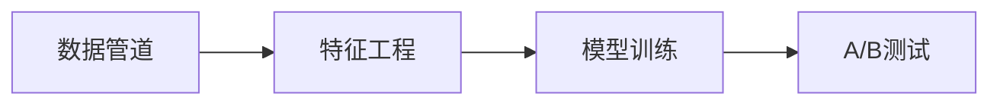
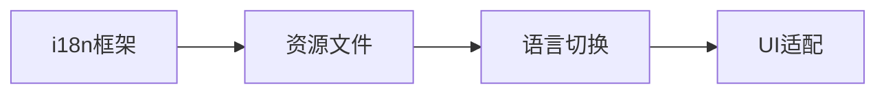

# 🗺️ 智能客服系统升级路线图

## 📋 快速概览

| 阶段 | 功能模块 | 时间 | 状态 |
|------|----------|------|------|
| ✅ **阶段0** | 基础功能完善 | 已完成 | 完成 |
| 🔄 **阶段1** | 基础架构升级 | 3-7天 | 待开始 |
| 🎯 **阶段2** | 核心功能开发 | 8-20天 | 待开始 |
| 🧪 **阶段3** | 测试与优化 | 21-30天 | 待开始 |
| 🚀 **阶段4** | 整合与发布 | 31-35天 | 待开始 |

## ✅ 已完成功能

### 基础系统搭建
- [x] 消息捕获服务 (CDP集成)
- [x] 推荐服务 (Aho-Corasick + FTS5)
- [x] UI界面 (Tkinter)
- [x] 配置管理系统
- [x] 健康检查和指标监控
- [x] 话术管理界面 (保存/删除)
- [x] 数据导入工具 (Telegram格式)
- [x] 导入界面增强 (预览/过滤)

## 🔄 下一步实施计划

### 阶段1: 基础架构升级 (Day 1-7)

#### 机器学习基础设施 (Day 1-3)


**关键任务:**
- [ ] 创建 `ml_service/` 目录结构
- [ ] 集成 PyTorch Lightning 训练框架
- [ ] 搭建数据分析端点 `/analytics`
- [ ] 实现用户交互数据收集

**预期产出:**
- ML训练环境搭建完成
- 数据收集管道就绪
- A/B测试框架基础版

#### 多语言架构改造 (Day 4-7)


**关键任务:**
- [ ] 创建 `quickreply/i18n/` 模块
- [ ] 提取所有UI硬编码文本
- [ ] 创建中英文资源文件
- [ ] 实现语言切换功能

**预期产出:**
- 完整的i18n框架
- 中英文界面支持
- 语言切换菜单

### 阶段2: 核心功能开发 (Day 8-20)

#### ML推荐模型 (Day 8-14)
```python
# 核心组件架构
CandidateGenerator()  # 候选生成
↓
ContextAwareRanker()  # 精排模型
↓  
MultiTaskOptimizer() # 多目标优化
↓
OnlineServing()      # 在线服务
```

**关键任务:**
- [ ] 实现BERT多语言嵌入
- [ ] 构建Faiss向量索引
- [ ] 开发上下文感知排序模型
- [ ] 集成TorchServe模型服务

#### 多语言内容处理 (Day 15-20)
```python
# 处理流程
LanguageDetection() # 语言识别
↓
TranslationPipeline() # 机器翻译
↓
QualityAssurance()   # 质量保证
↓
DatabaseIntegration() # 数据库集成
```

**关键任务:**
- [ ] 集成DeepL翻译API
- [ ] 扩展数据库schema支持多语言
- [ ] 实现语言检测缓存
- [ ] 创建专业术语库

### 阶段3: 测试与优化 (Day 21-30)

#### 性能测试 (Day 21-25)
- [ ] ML模型推理性能测试
- [ ] 多语言UI响应性测试
- [ ] 数据库查询优化
- [ ] 缓存策略优化

#### 用户体验测试 (Day 26-30)
- [ ] 多语言界面适配测试
- [ ] 推荐准确率评估
- [ ] 用户反馈收集机制
- [ ] 文档本地化

### 阶段4: 整合与发布 (Day 31-35)

#### 系统整合 (Day 31-33)
- [ ] ML推荐与多语言系统整合
- [ ] 端到端功能测试
- [ ] 性能基准测试
- [ ] 安全性检查

#### 生产部署 (Day 34-35)
- [ ] 灰度发布配置
- [ ] 监控告警设置
- [ ] 用户培训文档
- [ ] 正式发布

## 🎯 关键里程碑

### 里程碑1: ML基础就绪 (Day 7)
- ✅ 训练环境搭建完成
- ✅ 数据收集开始
- ✅ 多语言UI基础版

### 里程碑2: 核心功能完成 (Day 20)
- ✅ ML推荐模型上线
- ✅ 8种语言支持
- ✅ 翻译质量达标

### 里程碑3: 系统优化完成 (Day 30)
- ✅ 性能指标达标
- ✅ 用户体验优化
- ✅ 稳定性验证

### 里程碑4: 正式发布 (Day 35)
- ✅ 生产环境部署
- ✅ 用户培训完成
- ✅ 运维文档就绪

## 📊 成功指标追踪

### 技术指标
| 指标 | 当前值 | 目标值 | 进度 |
|------|--------|--------|------|
| 推荐准确率 | 65% | 85% | 🔄 |
| 响应延迟 | 150ms | <100ms | 🔄 |
| 语言覆盖 | 1 | 8 | 🔄 |
| 翻译质量 | - | BLEU>0.8 | 🔄 |

### 业务指标  
| 指标 | 当前值 | 目标值 | 进度 |
|------|--------|--------|------|
| 用户采纳率 | 45% | 70% | 🔄 |
| 响应效率 | +30% | +50% | 🔄 |
| 用户满意度 | 3.2/5 | 4.5/5 | 🔄 |

## 🚨 风险与应对

### 🔴 高风险
1. **ML模型性能不达预期**
   - 🛡️ 准备3套备选架构
   - 🔄 保留传统推荐系统

2. **翻译质量问题**
   - 🛡️ 人工校验流程
   - 🔄 重点语言优先

### 🟡 中风险
1. **开发进度延期**
   - 🛡️ 敏捷开发，分批交付
   - 🔄 核心功能优先

2. **系统稳定性**
   - 🛡️ 灰度发布策略
   - 🔄 功能开关机制

## 📞 项目联系人

- **项目负责人**: AI开发团队
- **技术架构**: ML工程师团队  
- **产品设计**: UX/UI团队
- **质量保证**: 测试工程师团队

---

**📅 最后更新**: 2025年9月23日  
**📊 完成进度**: 30% (基础功能完成)  
**🎯 下一里程碑**: Day 7 - ML基础就绪

> 💡 **提示**: 查看详细技术方案请参考 `UPGRADE_PLAN.md`
