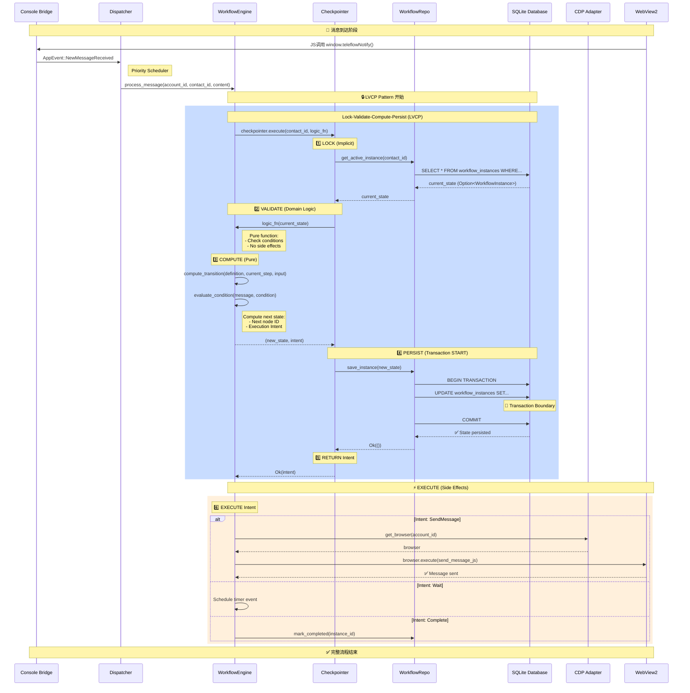
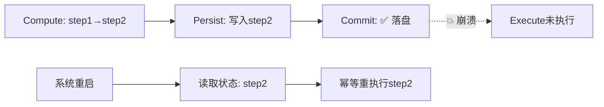
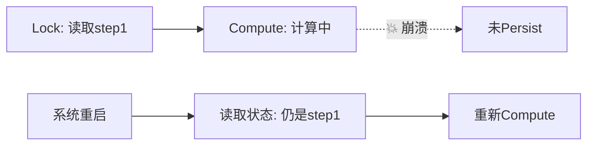

# LVCP 流程时序图

> **Lock-Validate-Compute-Persist-Commit-Execute Pattern**  
> 用于工作流引擎的原子性状态转换与断点续传

---

## 完整生命周期时序图



---

## 关键设计要点

### 事务边界标注

```
┌─────────────────────────────────┐
│  BEGIN TRANSACTION              │  ← Persist 阶段开始
│                                 │
│  UPDATE workflow_instances SET  │
│    current_node_id = 'step2',   │
│    updated_at = NOW()           │
│  WHERE id = 'inst_123'          │
│                                 │
│  COMMIT                         │  ← Persist 阶段结束
└─────────────────────────────────┘
     ↑                      ↑
   持久化                 事务保证
```

**临界点**: Commit 后,即使进程崩溃,状态已安全落盘。

---

## 崩溃恢复场景

### 场景1: Commit 后,Execute 前崩溃



**保证**: 状态持久化,重启后从 step2 继续,幂等执行不产生副作用。

### 场景2: Compute 阶段崩溃



**保证**: 未Commit,状态回滚,重新计算无数据污染。

---

## Checkpointer 抽象优势

### 纯函数式计算

```rust
// ✅ Pure: 无副作用,可测试
fn compute_logic(state: Option<WorkflowInstance>) 
    -> Result<(Option<WorkflowInstance>, Intent)> 
{
    let new_state = transition(state, input)?;
    let intent = Intent::SendMessage(msg);
    Ok((new_state, intent))
}

// ❌ Impure: 混合副作用,难测试
fn process_message(state) -> Result<()> {
    let new_state = transition(state)?;
    db.save(new_state)?;        // 副作用1
    browser.send_message()?;    // 副作用2
}
```

### 可组合性

```rust
checkpointer.execute(contact_id, |state| {
    // Domain logic only
    let next_step = engine.compute_transition(state)?;
    Ok((next_step, intent))
})
.await?;

// Execute phase (separated)
execute_intent(intent, cdp_adapter).await?;
```

---

## 性能特征

| 阶段 | 复杂度 | 可并发 | 副作用 |
|-----|-------|--------|--------|
| Lock | O(1) | ❌ | DB Read |
| Validate | O(n) | ✅ | 无 |
| Compute | O(n) | ✅ | 无 |
| Persist | O(1) | ❌ | DB Write |
| Commit | O(1) | ❌ | DB Commit |
| Execute | O(1) | ✅ | CDP/网络 |

**优化点**:
- Validate + Compute 可CPU密集并行
- Execute 可异步批处理

---

## 对比其他模式

### vs. 乐观锁(Optimistic Locking)

| 特性 | LVCP | 乐观锁 |
|-----|------|--------|
| 冲突处理 | 串行化 | 重试 |
| 适用场景 | 高冲突 | 低冲突 |
| 实现复杂度 | 低 | 中 |

### vs. Event Sourcing

| 特性 | LVCP | Event Sourcing |
|-----|------|----------------|
| 状态存储 | 当前状态 | 事件流 |
| 审计能力 | 需额外日志 | 原生支持 |
| 查询性能 | 高(直接读) | 低(需重放) |

---

## 监控指标

建议埋点位置:

```rust
// 1. LVCP 完整耗时
timer.start("lvcp.total");
checkpointer.execute(...).await?;
timer.stop("lvcp.total");

// 2. 各阶段耗时
timer.record("lvcp.lock", lock_duration);
timer.record("lvcp.compute", compute_duration);
timer.record("lvcp.persist", persist_duration);

// 3. Execute 成功率
counter.inc("lvcp.execute.success");
counter.inc("lvcp.execute.failure");
```

---

## 总结

LVCP 模式通过明确的**事务边界**和**纯函数分离**,实现了:

✅ **原子性**: Commit 前后的清晰边界  
✅ **可恢复性**: 任意阶段崩溃都可安全恢复  
✅ **可测试性**: 纯函数 Compute 易于单元测试  
✅ **可维护性**: 关注点分离,逻辑清晰

这是构建高可靠状态机的**唯一合理解**。
